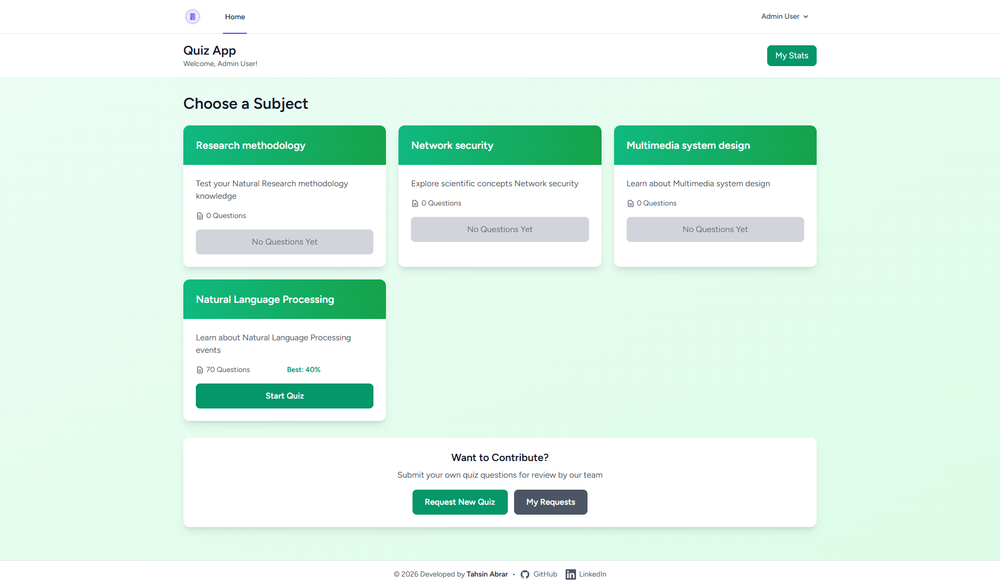
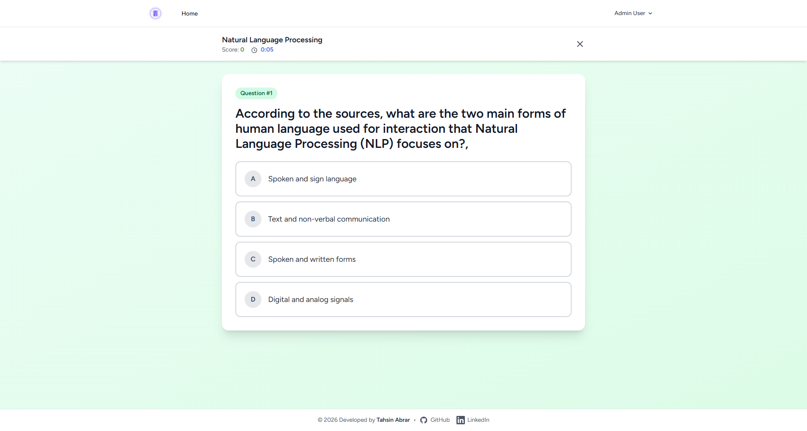
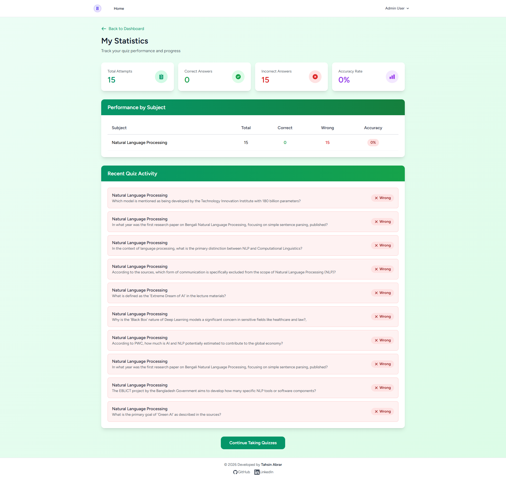
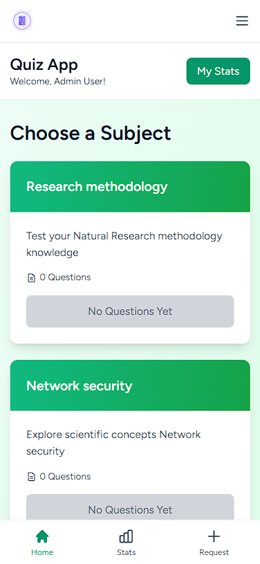

<div align="center">


# 🎓 Quiz Application

**A Modern, Feature-Rich Quiz Management System**

[](https://laravel.com)
[](https://filamentphp.com)
[](https://php.net)
[](LICENSE)

A comprehensive quiz management system built with Laravel and Filament, featuring customizable quizzes, real-time timer tracking, mobile-responsive design, and an intuitive admin panel for content management.

[Features](#-features) • [Screenshots](#-screenshots) • [Installation](#-installation) • [Configuration](#%EF%B8%8F-configuration) • [Usage](#-usage)

</div>

---

## ✨ Features

### 🎯 For Students/Users

- **📝 Customizable Quiz Experience**
    - Select number of questions (5, 10, 15, 20, or custom count)
    - Randomized questions prevent pattern memorization
    - Instant feedback on answers with explanations
- **⏱️ Advanced Timer System**
    - Live timer during quiz-taking
    - Per-question time tracking
    - Detailed timing analytics on results page
    - Average time per question calculation

- **📊 Performance Analytics**
    - Real-time score tracking
    - Comprehensive results breakdown
    - Subject-wise performance history
    - Personal statistics dashboard

- **📱 Mobile-First Design**
    - Fully responsive interface
    - Fixed bottom navigation on mobile
    - Optimized touch interactions
    - App-like mobile experience

- **🤝 Community Contribution**
    - Submit quiz questions for review
    - Bulk question import via JSON
    - Track submission status
    - View admin feedback

### 👨‍💼 For Administrators

- **🎨 Modern Admin Panel** (Powered by Filament)
    - Intuitive dashboard interface
    - Dark mode support
    - Quick stats overview

- **📚 Subject Management**
    - Create and organize subjects
    - Activate/deactivate subjects
    - Track question counts per subject

- **❓ Question Management**
    - Rich question editor
    - Multiple choice options (A/B/C/D)
    - Bulk import/export capabilities
    - Active/inactive status control

- **✅ Approval Workflow**
    - Review user-submitted questions
    - Approve or reject with notes
    - Auto-conversion to active questions
    - Moderation history tracking

---

## 📸 Screenshots

<div align="center">

### Dashboard - Subject Selection


_Browse available subjects and start quizzes with custom question counts_

### Quiz Interface with Timer


_Real-time timer tracking and instant answer feedback_

### Results & Analytics


_Comprehensive results with timing analytics and performance breakdown_

### Mobile Experience

 <br/>
_Responsive design with fixed bottom navigation_

</div>

---

## 🚀 Installation

### Prerequisites

Before installing, ensure you have the following installed on your system:

| Requirement       | Minimum Version | Recommended   | Purpose                    |
| ----------------- | --------------- | ------------- | -------------------------- |
| **PHP**           | 8.2             | 8.3+          | Backend runtime            |
| **Composer**      | 2.5+            | Latest        | PHP dependency manager     |
| **Node.js**       | 18.x            | 20.x LTS      | Frontend build tools       |
| **NPM/PNPM**      | 9.x             | Latest        | JavaScript package manager |
| **MySQL/MariaDB** | 8.0 / 10.6      | Latest Stable | Database (or SQLite)       |
| **Git**           | 2.x             | Latest        | Version control            |

#### Optional But Recommended

- **Redis** - For caching and session management
- **Supervisor** - For queue worker management

### Step-by-Step Installation

#### 1️⃣ Clone the Repository

```bash
# Clone via HTTPS
git clone https://github.com/yourusername/quiz-application.git

# Or clone via SSH
git clone git@github.com:yourusername/quiz-application.git

# Navigate to project directory
cd quiz-application
```

#### 2️⃣ Install PHP Dependencies

```bash
# Install Laravel and all PHP packages
composer install

# For production, use:
composer install --optimize-autoloader --no-dev
```

#### 3️⃣ Install JavaScript Dependencies

```bash
# Using NPM
npm install

# Or using PNPM (faster)
pnpm install

# Or using Yarn
yarn install
```

#### 4️⃣ Environment Configuration

```bash
# Copy environment file
cp .env.example .env

# Generate application key
php artisan key:generate
```

#### 5️⃣ Database Setup

##### Option A: SQLite (Easiest for Development)

```bash
# Create SQLite database file
touch database/database.sqlite

# Update .env file
DB_CONNECTION=sqlite
# Comment out or remove other DB_* variables
```

##### Option B: MySQL/MariaDB (Recommended for Production)

```bash
# Create database
mysql -u root -p
CREATE DATABASE quiz_app CHARACTER SET utf8mb4 COLLATE utf8mb4_unicode_ci;
EXIT;

# Update .env file
DB_CONNECTION=mysql
DB_HOST=127.0.0.1
DB_PORT=3306
DB_DATABASE=quiz_app
DB_USERNAME=your_username
DB_PASSWORD=your_password
```

#### 6️⃣ Run Migrations

```bash
# Run all migrations
php artisan migrate

# Or run migrations with sample data
php artisan migrate:fresh --seed
```

This creates the following tables:

- `users` - User accounts
- `subjects` - Quiz subjects/categories
- `questions` - Quiz questions with options
- `quiz_attempts` - User quiz history with timing data
- `quiz_requests` - User-submitted questions

#### 7️⃣ Create Admin User

```bash
# Create Filament admin user
php artisan make:filament-user
```

You'll be prompted to enter:

- Name
- Email
- Password

**Alternative**: Add `role` column to an existing user:

```bash
php artisan tinker
>>> $user = User::where('email', 'your@email.com')->first();
>>> $user->role = 'admin';
>>> $user->save();
```

#### 8️⃣ Build Frontend Assets

```bash
# For development (with hot reload)
npm run dev

# For production (optimized build)
npm run build
```

#### 9️⃣ Start the Application

```bash
# Start Laravel development server
php artisan serve

# The application will be available at:
# http://localhost:8000 (or http://127.0.0.1:8000)
```

For development, run both commands in separate terminals:

```bash
# Terminal 1: Laravel server
php artisan serve

# Terminal 2: Vite dev server (hot reload)
npm run dev
```

---

## ⚙️ Configuration

### Environment Variables

Edit the `.env` file to configure your application:

#### Application Settings

```env
APP_NAME="Quiz Application"
APP_ENV=local          # local, production
APP_DEBUG=true         # Set to false in production
APP_URL=http://localhost:8000
APP_TIMEZONE=UTC       # Your timezone (e.g., Asia/Dhaka)
```

#### Database Configuration

```env
# For SQLite
DB_CONNECTION=sqlite
DB_DATABASE=/absolute/path/to/database.sqlite

# For MySQL
DB_CONNECTION=mysql
DB_HOST=127.0.0.1
DB_PORT=3306
DB_DATABASE=quiz_app
DB_USERNAME=root
DB_PASSWORD=your_password
```

#### Cache & Session

```env
CACHE_DRIVER=file      # file, redis, memcached
SESSION_DRIVER=file    # file, database, redis
QUEUE_CONNECTION=sync  # sync, database, redis
```

#### Mail Configuration (for password resets)

```env
MAIL_MAILER=smtp
MAIL_HOST=smtp.gmail.com
MAIL_PORT=587
MAIL_USERNAME=your-email@gmail.com
MAIL_PASSWORD=your-app-password
MAIL_ENCRYPTION=tls
MAIL_FROM_ADDRESS=noreply@quizapp.com
MAIL_FROM_NAME="${APP_NAME}"
```

### File Permissions

Set proper permissions for storage and cache:

```bash
# Linux/Mac
chmod -R 775 storage bootstrap/cache
chown -R www-data:www-data storage bootstrap/cache

# Or using your current user
sudo chown -R $USER:www-data storage bootstrap/cache
```

### Production Optimization

```bash
# Cache configuration
php artisan config:cache

# Cache routes
php artisan route:cache

# Cache views
php artisan view:cache

# Optimize autoloader
composer install --optimize-autoloader --no-dev

# Build production assets
npm run build
```

---

## 🎮 Usage

### Accessing the Application

| Interface          | URL                            | Purpose                  |
| ------------------ | ------------------------------ | ------------------------ |
| **User Interface** | http://localhost:8000          | Take quizzes, view stats |
| **Admin Panel**    | http://localhost:8000/admin    | Manage content           |
| **Login**          | http://localhost:8000/login    | User authentication      |
| **Register**       | http://localhost:8000/register | New account creation     |

### Default Test Accounts

If you ran the database seeder (`--seed`), use these credentials:

**Regular User:**

- Email: `user@example.com`
- Password: `password`

**Admin User:**

- Email: `admin@example.com`
- Password: `password`

> ⚠️ **Important**: Change these passwords in production!

### Taking a Quiz (User Workflow)

1. **Login** to your account
2. **Browse subjects** on the dashboard
3. **Click "Start Quiz"** on any subject
4. **Select question count** (5, 10, 15, 20, or custom)
5. **Answer questions** - timer tracks your progress
6. **View results** with timing analytics
7. **Check statistics** on your profile

### Managing Content (Admin Workflow)

1. **Login** to the admin panel at `/admin`
2. **Navigate** to Subjects/Questions/Requests
3. **Create/Edit** content using the intuitive interface
4. **Approve** user-submitted questions
5. **Monitor** quiz statistics and user activity

### Submitting Questions (User Contribution)

#### Single Question Submission

1. Click **"Request New Quiz"** on dashboard
2. Select the **Subject**
3. Enter **Question Text**
4. Fill in **4 Options** (A, B, C, D)
5. Select the **Correct Answer**
6. Submit for admin review

#### Bulk Question Import (JSON)

Use the "Bulk Import" tab with this format:

```json
[
    {
        "subject_id": 1,
        "question_text": "What is 2 + 2?",
        "option_a": "3",
        "option_b": "4",
        "option_c": "5",
        "option_d": "6",
        "correct_answer": "b"
    },
    {
        "subject_id": 2,
        "question_text": "What is the capital of France?",
        "option_a": "London",
        "option_b": "Berlin",
        "option_c": "Paris",
        "option_d": "Madrid",
        "correct_answer": "c"
    }
]
```

---

## 🗂️ Project Structure

```
quiz-application/
│
├── app/
│   ├── Filament/                  # Admin panel configuration
│   │   └── Resources/             # Subject, Question, QuizRequest resources
│   ├── Http/
│   │   ├── Controllers/           # Frontend controllers
│   │   │   ├── QuizController.php         # Quiz logic & timer
│   │   │   ├── SubjectController.php      # Subject listing
│   │   │   └── QuizRequestController.php  # Question submission
│   │   └── Middleware/            # Custom middleware
│   └── Models/                    # Eloquent models
│       ├── User.php
│       ├── Subject.php
│       ├── Question.php
│       ├── QuizAttempt.php       # Includes timer data
│       └── QuizRequest.php
│
├── database/
│   ├── migrations/                # Database schema
│   │   ├── *_create_subjects_table.php
│   │   ├── *_create_questions_table.php
│   │   ├── *_create_quiz_attempts_table.php
│   │   ├── *_add_timing_to_quiz_attempts_table.php  # Timer feature
│   │   └── *_create_quiz_requests_table.php
│   └── seeders/                   # Sample data
│       └── DatabaseSeeder.php
│
├── resources/
│   └── views/                     # Blade templates
│       ├── subjects/
│       │   └── index.blade.php    # Subject selection
│       ├── quiz/
│       │   ├── show.blade.php     # Quiz interface with timer
│       │   └── results.blade.php  # Results with analytics
│       ├── quiz-requests/
│       │   ├── create.blade.php   # Single/bulk question submission
│       │   └── index.blade.php    # User's submitted questions
│       ├── profile/
│       │   └── dashboard.blade.php # User statistics
│       ├── components/
│       │   └── bottom-nav.blade.php # Mobile navigation
│       └── layouts/
│           ├── app.blade.php      # Main layout
│           └── guest.blade.php    # Auth layout
│
├── routes/
│   └── web.php                    # Application routes
│
├── public/                        # Public assets
├── storage/                       # Uploaded files, logs, cache
└── tests/                         # Automated tests
```

---

## 🛠️ Troubleshooting

### Common Issues & Solutions

#### 1. "Permission Denied" Errors

```bash
# Fix storage permissions
chmod -R 775 storage bootstrap/cache
sudo chown -R $USER:www-data storage bootstrap/cache
```

#### 2. "Class not found" Errors

```bash
# Clear and rebuild autoloader
composer dump-autoload
php artisan clear-compiled
php artisan cache:clear
```

#### 3. Database Connection Errors

```bash
# Test database connection
php artisan migrate:status

# Reset database if needed
php artisan migrate:fresh --seed
```

#### 4. Vite/Asset Build Errors

```bash
# Clear npm cache
npm cache clean --force

# Reinstall dependencies
rm -rf node_modules package-lock.json
npm install

# Rebuild assets
npm run build
```

#### 5. Admin Panel Not Accessible

```bash
# Verify admin user role
php artisan tinker
>>> User::where('email', 'admin@example.com')->update(['role' => 'admin']);
```

#### 6. Timer Not Working

- Ensure JavaScript is enabled in browser
- Check browser console for errors
- Verify Vite development server is running (`npm run dev`)

---

## 📊 Database Schema

### ERD Overview

```
┌─────────────┐       ┌──────────────┐       ┌─────────────────┐
│   users     │       │   subjects   │       │   questions     │
├─────────────┤       ├──────────────┤       ├─────────────────┤
│ id          │       │ id           │───┐   │ id              │
│ name        │───┐   │ name         │   │   │ subject_id (FK) │
│ email       │   │   │ description  │   └──▶│ question_text   │
│ password    │   │   │ is_active    │       │ option_a        │
│ role        │   │   └──────────────┘       │ option_b        │
└─────────────┘   │                          │ option_c        │
                  │   ┌──────────────┐       │ option_d        │
                  │   │quiz_attempts │       │ correct_answer  │
                  │   ├──────────────┤       │ is_active       │
                  └──▶│ user_id (FK) │       │ created_by (FK) │
                      │ subject_id   │       └─────────────────┘
                      │ question_id  │              │
                      │ selected_ans │              │
                      │ is_correct   │              │
                      │ time_taken   │◀─────────────┘
                      │ started_at   │
                      └──────────────┘
                             ▲
                             │
                      ┌──────────────┐
                      │quiz_requests │
                      ├──────────────┤
                      │ user_id (FK) │
                      │ subject_id   │
                      │ question_text│
                      │ option_a/b/c │
                      │ correct_ans  │
                      │ status       │
                      └──────────────┘
```

---

## 🤝 Contributing

We welcome contributions! Here's how you can help:

1. 🍴 Fork the repository
2. 🔨 Create a feature branch (`git checkout -b feature/AmazingFeature`)
3. 💬 Commit your changes (`git commit -m 'Add some AmazingFeature'`)
4. 📤 Push to the branch (`git push origin feature/AmazingFeature`)
5. 🎯 Open a Pull Request

### Development Guidelines

- Follow PSR-12 coding standards
- Write tests for new features
- Update documentation as needed
- Use meaningful commit messages
